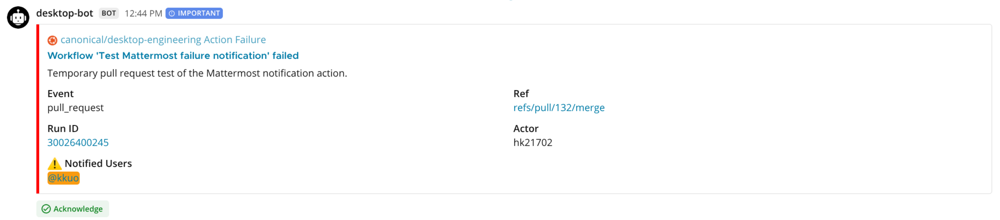

# Notify Mattermost on failure

Posts a workflow failure notification to a Mattermost channel using a bot account.



## Requirements

The bot must be a member of the target channel and its token must be able to create posts. Store the token as a GitHub Actions secret. The Mattermost server URL and channel ID can be stored as repository or organization variables.

## Usage

```yaml
- name: Notify Mattermost on failure
  if: ${{ failure() }}
  uses: canonical/desktop-engineering/gh-actions/common/notify-mm-on-failure@main
  with:
    server-url: ${{ vars.MATTERMOST_SERVER_URL }}
    channel-id: ${{ vars.MATTERMOST_CHANNEL_ID }}
    bot-token: ${{ secrets.MATTERMOST_BOT_TOKEN }}
    ping-users: alice,bob
    additional-info: The package build did not complete.
    request-ack: true
    silent: true
    priority: important
```

The action does not check the workflow result itself. Callers must use an appropriate condition, such as `failure()`.

## Inputs

| Input             | Required | Default      | Description                                                                                  |
| ----------------- | -------- | ------------ | -------------------------------------------------------------------------------------------- |
| `server-url`      | Yes      |              | Base URL of the Mattermost server.                                                           |
| `channel-id`      | Yes      |              | ID of the Mattermost channel to notify.                                                      |
| `bot-token`       | Yes      |              | Access token for the Mattermost bot account.                                                 |
| `ping-users`      | No       | `""`         | Comma-separated Mattermost usernames to mention in the notified users field.                 |
| `additional-info` | No       | `""`         | Markdown-formatted information to include in the notification.                               |
| `color`           | No       | `#FF0000`    | Color of the notification attachment.                                                        |
| `author-icon`     | No       | `repo-owner` | URL of the attachment author icon. See [Author icon](#author-icon).                          |
| `request-ack`     | No       | `"true"`     | Whether users must acknowledge the notification.                                             |
| `silent`          | No       | `"false"`    | Whether to deliver the post without user notifications or unread counts.                     |
| `priority`        | No       | `""`         | Mattermost post priority. See [Priority and acknowledgement](#priority-and-acknowledgement). |

## Notification Behavior

### Priority and acknowledgement

Acknowledgement is requested by default, which marks the post as important. Set `request-ack` to `"false"` to send a notification without requiring acknowledgement.

Set `priority` to override the post priority. When it is empty, the action uses `important` if acknowledgement is requested and otherwise omits priority metadata.

### Silent posts

Set `silent` to `"true"` to post without desktop, push, or email notifications and without incrementing unread or mention counts.

### Author icon

The attachment author icon defaults to the calling repository owner's GitHub icon. Set `author-icon` to a URL to override it, or to an empty string (`author-icon: ""`) to omit the icon.

## API

The action calls the [Mattermost `POST /api/v4/posts` endpoint](https://developers.mattermost.com/api-documentation/#/operations/CreatePost).
